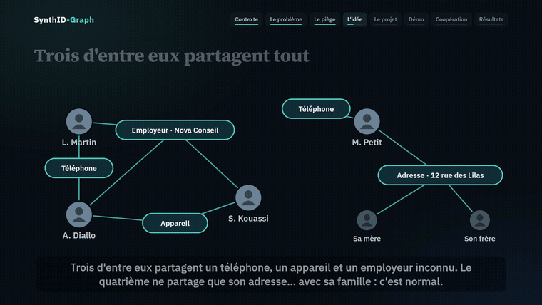
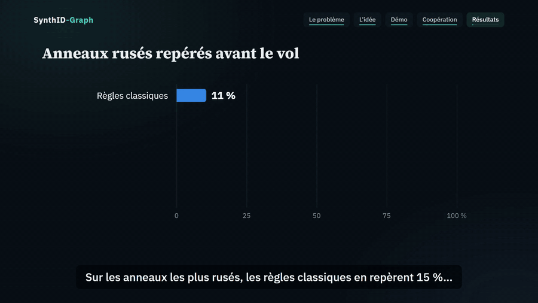
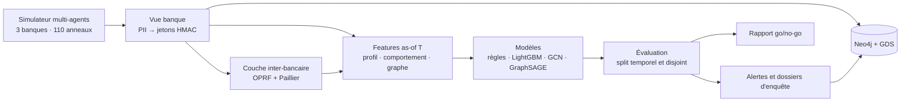

# SynthID-Graph

**Repérer les anneaux d'identités synthétiques avant qu'ils ne vident les comptes**, grâce à l'analyse de graphes, aux réseaux de neurones sur graphe (GNN) et à une coopération entre banques chiffrée de bout en bout.

[](https://github.com/asaphfelix03-beep/synthid-graph/actions/workflows/ci.yml)




▶ **Vidéo de présentation (2 min 17)** : [version sous-titrée](docs/media/synthid-graph-video-720p.mp4) · [version avec voix off](docs/media/synthid-graph-video-720p-voix.mp4)

---

## Le problème

Une **identité synthétique** mélange un vrai numéro d'identité (souvent volé à un enfant ou à une personne âgée) avec un nom et des contacts inventés. Le fraudeur la fait vivre comme un client modèle pendant des mois, puis vide tous les plafonds de crédit en quelques jours : c'est le **bust-out**. Comme la personne n'existe pas, personne ne rembourse.

Vu un par un, ces faux clients sont irréprochables : ils paient à l'heure, déclarent un emploi et un revenu normal. Les règles classiques passent à côté. Mais un fraudeur gère des dizaines d'identités à la fois, un **anneau**, et elles partagent forcément des traces : un téléphone, un appareil, un employeur fictif, un compte hôte…

**Hypothèse testée** : vu seul, un fraudeur rusé est invisible, mais son réseau le trahit.

## Ce que fait le projet

| Brique | Ce qu'elle fait |
|---|---|
| **Simulateur multi-agents** | 3 banques, 20 684 identités, 110 anneaux de fraude sur 36 mois, avec des « pièges » : foyers, colocations, IP mobiles partagées, défauts de crédit légitimes… |
| **Vue banque** | Chaque donnée personnelle devient un jeton HMAC propre à la banque ; résolution d'entités (quasi-doublons) avant tokenisation |
| **Graphe Neo4j** | 198 000 nœuds, 682 000 relations, requêtes d'enquête en Cypher, Graph Data Science (WCC, Louvain) |
| **Features « as-of T »** | Profil, comportement, graphe (Adamic-Adar, communautés, PageRank, voisins de fraudes confirmées), sans jamais utiliser le futur |
| **Modèles** | Moteur de règles, LightGBM, GCN, GraphSAGE hétérogène (PyTorch Geometric), ensembles |
| **Coopération inter-bancaire** | Jetons communs par **OPRF**, compteurs chiffrés **Paillier 3072 bits** agrégés sans être lus, scoring chiffré |
| **Alertes** | Budget d'alertes réaliste, regroupement par communauté, dossiers d'enquête en Markdown |

## Résultats

Sur données simulées, avec un split temporel et des anneaux jamais vus à l'entraînement :

| Modèle | Anneaux **rusés** détectés avant le bust-out | Tous les anneaux | PR-AUC (1 % de fraude) |
|---|---:|---:|---:|
| Règles classiques | 15 % | 70,2 % | 0,623 |
| LightGBM, profil seul | 25 % | 73,7 % | 0,594 |
| LightGBM + features de graphe | 60 % | 86,0 % | 0,700 |
| Ensemble LightGBM + GraphSAGE | 85 % | 94,7 % | **0,765** |
| LightGBM + coopération chiffrée | **90 %** | **96,5 %** | 0,721 |

- **212 jours** d'anticipation médiane avant le bust-out.
- **0** donnée personnelle reçue par le serveur du consortium ; une attaque par dictionnaire retrouve 100 % des valeurs avec un simple SHA-256, **0 %** avec les jetons OPRF.
- Sur les clients honnêtes qui partagent des choses (foyers, colocations, personnes âgées aidées…), 1,2 % sont alertés, contre 2,0 % avec les règles. Exception : les colocations, alertées un peu plus souvent (3 % contre 2 %).



**Ce qui n'a pas marché, et c'est documenté :**
- Le GNN **seul** ne bat pas un LightGBM nourri de features de graphe bien construites (PR-AUC 0,861 contre 0,881). Combinés, ils donnent le meilleur résultat.
- Alerter des communautés entières fait chuter la précision (11 % contre 38 %). Il vaut mieux alerter compte par compte, puis regrouper pour l'enquête.

Rapport complet, avec 10 critères go/no-go : [docs/RESULTATS.md](docs/RESULTATS.md). Exemple de dossier généré : [docs/exemple-dossier-alerte.md](docs/exemple-dossier-alerte.md).

## Architecture



Le graphe est l'**union disjointe** des graphes des trois banques : les jetons sont propres à chaque banque, donc aucun message du GNN ne traverse une frontière bancaire. Le signal inter-bancaire passe uniquement par la couche chiffrée.

## Démarrage rapide

```bash
git clone https://github.com/asaphfelix03-beep/synthid-graph.git
cd synthid-graph
python -m venv .venv
source .venv/bin/activate            # Windows : .venv\Scripts\activate

pip install torch --index-url https://download.pytorch.org/whl/cpu   # PyTorch CPU, pour les GNN
pip install -e ".[gnn,dev]"

pytest -q                                                  # 18 tests
python -m synthid run --config configs/tiny.yaml --skip-neo4j   # essai complet en ≈ 3 min
```

Le rapport apparaît dans `reports/tiny/REPORT.md` et les dossiers d'alerte dans `reports/tiny/alertes/`.

**Expérience complète** (résultats ci-dessus, ≈ 35 min sur un CPU 8 cœurs) :

```bash
python -m synthid run --config configs/small.yaml --skip-neo4j
```

**Avec Neo4j** (Docker) :

```bash
pip install -e ".[neo4j]"
docker compose up -d                 # Neo4j 5.26 + APOC + GDS → http://localhost:7474
python -m synthid neo4j --config configs/small.yaml
```

Identifiants par défaut : `neo4j` / `synthid-poc-local`. Changez-les avec la variable `NEO4J_PASSWORD` (voir `.env.example`). Les requêtes d'enquête sont dans [cypher/queries.cypher](cypher/queries.cypher).

Chaque étape se relance séparément : `python -m synthid generate | features | privacy | train | evaluate | alerts | neo4j | report`.

| Extra | Contenu |
|---|---|
| *(base)* | simulateur, features, LightGBM, couche chiffrée, rapport |
| `gnn` | PyTorch + PyTorch Geometric (sans eux, l'étape `train` saute les GNN) |
| `neo4j` | pilote Neo4j |
| `video` | génération de la vidéo (Playwright, ffmpeg) |
| `dev` | pytest, ruff |

## Structure du dépôt

```
configs/          tiny.yaml (essai rapide) · small.yaml (expérience du rapport)
src/synthid/      simulate · bank_view · features · evaluation · models · gnn
                  alerts · graph_db · report · pipeline · cli
src/synthid/privacy/  oprf · paillier · consortium · scoring
cypher/           requêtes d'enquête Neo4j (queries.cypher)
tests/            fuite temporelle, absence de PII, exactitude crypto, splits
tools/video/      génération de la vidéo de présentation
docs/             résultats, exemple de dossier, médias
data/, reports/   sorties générées (non versionnées)
```

## Méthodologie

Le projet suit **CRISP-DM**. Chaque phase a son module et un jalon vérifié automatiquement :

| Phase | Jalon |
|---|---|
| Données | Audit de raccourcis : aucune feature isolée ne dépasse un AUC de 0,82 (seuil 0,9) |
| Features | Test : supprimer toutes les données postérieures à T ne change aucune feature calculée à T |
| Graphe | Test : aucune donnée personnelle en clair dans les tables bancaires |
| Modèles | Comparaison au meilleur baseline, par niveau de sophistication et sur un mode opératoire jamais vu |
| Inter-bancaire | Agrégats chiffrés exacts, 0 donnée personnelle reçue, sécurité ≥ 128 bits |

**Protocole d'évaluation.**
- Split temporel : entraînement à J+180…J+540, test à J+720…J+900.
- Anneaux et foyers disjoints entre entraînement et test.
- Un scénario de fraude (le marchand complice) absent de l'entraînement.
- 20 % des fraudes enregistrées comme de simples impayés, comme dans une vraie banque.
- Métriques ramenées à une prévalence réaliste de 1 %.

**Niveaux de fraudeurs.** Le niveau 3, le plus rusé, tire son profil et son comportement des *mêmes distributions* que les clients légitimes. C'est ce qui rend le test exigeant : sans le réseau, seuls 15 à 25 % de ces anneaux sont détectés.

**Modèle de menace de la couche chiffrée.** Parties honnêtes mais curieuses, sans collusion entre le hub et le service de tokenisation. La fuite résiduelle est assumée : le hub apprend quels jetons pseudonymes sont présents dans au moins deux banques, mais ni les données ni les volumes.

## Limites

- Données **entièrement simulées** : les chiffres dépendent des hypothèses du générateur.
- Une seule graine aléatoire, et 20 anneaux rusés au test : 5 points d'écart représentent un seul anneau.
- Hash-to-curve simplifié et clés dérivées d'une graine. En production, il faudrait suivre les RFC 9380 et 9497 et garder les clés dans un HSM.
- GNN entraînés « full batch » sur CPU. Au-delà d'environ un million de nœuds, il faut un GPU et un `NeighborLoader`.

## Feuille de route

- [ ] Valider sur un jeu public (Bank Account Fraud de Feedzai) ou sur des données réelles anonymisées
- [ ] Répéter l'évaluation sur plusieurs graines
- [ ] Expliquer les scores des GNN (GNNExplainer) en plus des valeurs SHAP de LightGBM
- [ ] Tester HGT et R-GCN, puis l'entraînement par voisinage
- [ ] Entraîner le modèle commun du consortium par apprentissage fédéré

## Vidéo de présentation

La vidéo est générée à partir des vraies captures du projet :

```bash
pip install -e ".[video]"
python tools/video/make_motion.py              # Windows : versions avec et sans voix off
python tools/video/make_motion.py --no-voice   # autres systèmes : version sous-titrée
```

## English summary

SynthID-Graph is an end-to-end proof of concept for detecting **synthetic identity fraud rings** before the bust-out. A multi-agent simulator generates three banks with 110 fraud rings, including sophisticated ones that are statistically indistinguishable from good customers. The project then:
- builds a tokenized identity graph in Neo4j;
- compares rules, LightGBM and graph neural networks (GCN, heterogeneous GraphSAGE);
- adds a privacy-preserving cross-bank layer (OPRF pseudonyms and packed Paillier aggregation), so that no personal data is ever exchanged.

On simulated data, graph and cross-bank signals raise the detection of sophisticated rings from 15 % (rules) to 90 %. Nearly 95 % of all rings are caught about 7 months before the bust-out.

## Licence

[MIT](LICENSE)
